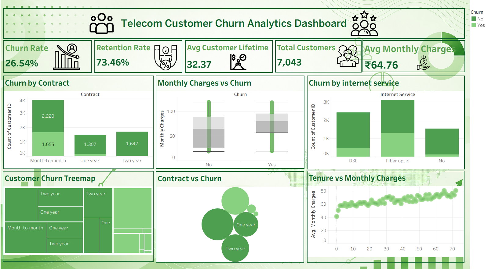

# Telecom Customer Churn Analytics Dashboard

## About The Project

This project is based on telecom customer churn analysis where customer data was analyzed to understand why customers are leaving the service and what factors help in customer retention.

Using Python and Tableau, the raw dataset was explored and converted into an interactive dashboard showing customer behaviour, churn trends, contract types, internet service patterns, and monthly charges analysis.

The main aim of this project was to get business insights in a simple and visual way.

---

## Tools \& Technologies Used

- Python

- Pandas

- Jupyter Notebook

- Tableau Public

---

## Key KPIs

- Churn Rate

- Retention Rate

- Average Customer Lifetime

- Total Customers

- Average Monthly Charges

---

## Dashboard Insights

- Customers with month-to-month contracts have the highest number of customers and also the highest churn rate

- Fiber optic users show higher churn behaviour compared to other internet services

- Customers with longer tenure usually have higher monthly charges

- Long-term contracts help in improving customer retention

- Customers with one year and two year contracts are more likely to stay with the company

---

## Visualizations Included

- Churn by Contract Type

- Churn by Internet Service

- Monthly Charges vs Churn

- Customer Churn Treemap

- Contract vs Churn Bubble Chart

- Tenure vs Monthly Charges Analysis

---

## Files Included

- `telecom\\\_Churn\\\_Analysis.twbx` → Tableau dashboard file

- `Telecom\\\_churn\\\_dashboard.png` → Dashboard screenshot

- `churn\\\_analysis.ipynb` → Python analysis notebook

- `Telco-Customer-Churn.csv` → Dataset used for analysis

---

## Conclusion

This project helped in understanding customer churn patterns and how data visualization can help businesses make better decisions.

The dashboard gives simple and interactive insights which can help companies identify risky customers, improve retention strategies, and understand customer behaviour more clearly.

